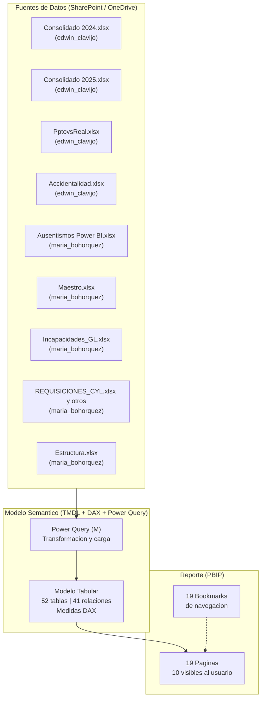
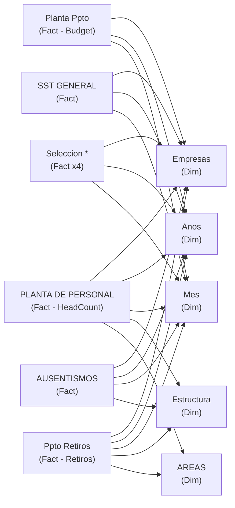

# Arquitectura del Proyecto

> Este documento describe la estructura tecnica del proyecto PBIP. Para el detalle de tablas y relaciones ver [DATA_MODEL.md](DATA_MODEL.md). Para las fuentes de datos ver [DATA_PIPELINE.md](DATA_PIPELINE.md).

---

## Estado arquitectónico actual (2026-07-17)

El proyecto ya opera como PBIP versionable con Git y documentación estructurada en `Docs/`, `Specs/` y `Outputs/`.

Puntos vigentes:

- `PBIP/Proyecto7.pbip` es el archivo de entrada.
- `Docs/` contiene documentación oficial.
- `Specs/` contiene análisis de impacto y planes aprobables.
- `Outputs/` contiene evidencias temporales y no debe versionarse por defecto.
- El modelo mantiene Power Query M en TMDL con conectores `Excel.Workbook(Web.Contents(...), null, true)`.
- La migración hacia SharePoint corporativo está parcialmente implementada.
- Persisten bloqueos o riesgos de Formula Firewall hasta validar `Aplicar cambios` y refresh local completo.
- No se ha aprobado refactor a `SharePoint.Contents`, `SharePoint.Files`, parámetros M ni funciones centralizadas.

Los diagramas de fuentes incluidos en este documento son una referencia estructural. Para el estado vigente de cada URL y fuente, usar [DATA_PIPELINE.md](DATA_PIPELINE.md) y [PROJECT_STATUS.md](PROJECT_STATUS.md).

## Formato del proyecto: PBIP

El proyecto utiliza el formato **Power BI Project (PBIP)**, que separa el reporte y el modelo semantico en carpetas independientes versionables como texto plano.

```
PBIP/
├── Proyecto7.pbip                       # Manifest del proyecto (JSON, schema v1.0) — renombrado 2026-06-17 (commit cfb3a15)
├── .gitignore                           # Exclusiones de Git
├── Proyecto.Report/                     # Capa de presentacion
│   ├── definition.pbir                  # Referencia al SemanticModel
│   ├── definition/
│   │   ├── report.json                  # Configuracion global del reporte
│   │   ├── version.json                 # Version del schema del reporte
│   │   ├── pages/                       # Una subcarpeta por pagina (19 paginas)
│   │   └── bookmarks/                   # 19 bookmarks de navegacion
│   ├── StaticResources/
│   │   ├── RegisteredResources/         # Imagenes embebidas (4 archivos: portada, empleados, hombre, mujer)
│   │   └── SharedResources/BaseThemes/  # Tema base CY23SU08
│   └── .pbi/localSettings.json
└── Proyecto.SemanticModel/              # Capa de datos y logica
    ├── definition.pbism                 # Entrada del modelo semantico
    ├── definition/
    │   ├── model.tmdl                   # Configuracion del modelo, grupos de consulta, orden de tablas
    │   ├── relationships.tmdl           # 41 relaciones explicitas
    │   ├── database.tmdl                # Propiedades de base de datos
    │   ├── cultures/es-ES.tmdl          # Localizacion espanol espana
    │   └── tables/                      # 52 archivos .tmdl (una tabla por archivo) — verificado 2026-07-03
    ├── DAXQueries/Consulta 1.dax        # Consulta DAX de desarrollo guardada
    ├── diagramLayout.json               # Posicion visual del diagrama de relaciones
    └── .pbi/
        ├── cache.abf                    # Cache binario Analysis Services (ignorar en Git)
        ├── editorSettings.json
        └── localSettings.json
```

> Evidencia: inventario completo obtenido de `Get-ChildItem -Recurse -Depth 4`.

---

## Diagrama de capas



---

## Grupos de consulta (Query Groups)

El modelo organiza las tablas de hechos en seis grupos de consulta definidos en `model.tmdl`:

| Orden | Grupo | Tablas principales | Proposito |
|---|---|---|---|
| 0 | `HeadCount` | `PLANTA DE PERSONAL`, `Consolidado2025` | Planta activa historica |
| 1 | `PptovsReal` | `Planta Ppto`, `Ppto Retiros`, `Ppto Ingresos` | Presupuesto vs ejecucion real |
| 2 | `Seleccion` | `Seleccion Challenger`, `Seleccion Habitel Hotels`, `Seleccion Grupo Sky`, `Seleccion Grupo Lemco` | Procesos de seleccion por empresa |
| 3 | `Dim_Calendario` | `Mes`, `Anos`, `Trimestres`, `DimPeriodoYM` | Dimensiones temporales |
| 4 | `SST` | `SST GENERAL`, `SST_CHA`, `SST-HABITELH`, `SST-GSKY`, `ACCIDENTALIDAD` | Seguridad y Salud en el Trabajo |
| 5 | `Incapacidades` | `Incapacidades` | Incapacidades medicas con CIE-10 |

> Las dimensiones maestras (`Empresas`, `Grupo Empresarial`, `Estructura`, `AREAS`, `Maestro`, etc.) no tienen grupo de consulta asignado explicitamente.

---

## Configuracion global del modelo

| Parametro | Valor | Fuente |
|---|---|---|
| Cultura del modelo | `es-ES` | `model.tmdl` |
| Cultura de consulta de origen | `es-CO` | `model.tmdl` |
| Inteligencia de tiempo habilitada | Si (`__PBI_TimeIntelligenceEnabled = 1`) | `model.tmdl` |
| Version de fuente de datos Power BI | `powerBI_V3` | `model.tmdl` |
| Modo de desarrollador | Si (`PBI_ProTooling = ["DevMode"]`) | `model.tmdl` |
| Timeout del reporte | 225 segundos | `report.json` |
| Limite de memoria personalizado | 1 GB (1048576 KB) | `report.json` |
| Tema base | CY23SU08 | `report.json` |
| Exportacion de datos | Solo resumidos (`AllowSummarized`) | `report.json` |

---

## Tablas autogeneradas por Power BI

Power BI genera automaticamente las siguientes tablas que **no deben editarse manualmente**:

| Tipo | Cantidad | Descripcion |
|---|---|---|
| `DateTableTemplate_*` | 1 | Plantilla base para tablas de calendario locales |
| `LocalDateTable_*` | 18 | Una tabla de calendario por cada columna de tipo fecha no conectada a un calendario compartido |

> Las 18 `LocalDateTable` representan un riesgo de rendimiento. Ver [DATA_MODEL.md — Riesgos](DATA_MODEL.md#riesgos-del-modelo).

---

## Archivos relevantes para operaciones

| Archivo | Proposito operativo |
|---|---|
| `PBIP/Proyecto7.pbip` | Punto de apertura del proyecto en Power BI Desktop |
| `PBIP/Proyecto.SemanticModel/definition/model.tmdl` | Orden de carga de tablas y grupos de consulta |
| `PBIP/Proyecto.SemanticModel/definition/relationships.tmdl` | Todas las relaciones del modelo |
| `PBIP/Proyecto.SemanticModel/definition/tables/*.tmdl` | Definicion individual de cada tabla (Power Query + DAX) |
| `PBIP/Proyecto.SemanticModel/DAXQueries/Consulta 1.dax` | Consulta de prueba DAX guardada en el proyecto |
| `PBIP/.gitignore` | Exclusiones del control de versiones |

---

## Arquitectura de datos: patron de estrella con multiples hechos

El modelo sigue un esquema en estrella con multiples tablas de hechos que comparten dimensiones comunes:



Para el detalle completo de relaciones y cardinalidades ver [DATA_MODEL.md](DATA_MODEL.md).
