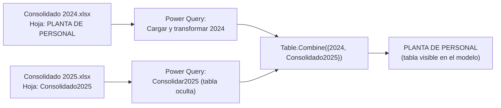
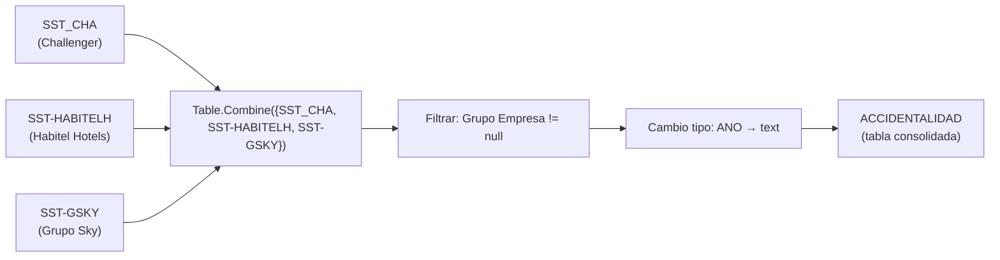

# Pipeline de Datos

> Fuente oficial de informacion sobre origenes de datos, transformaciones Power Query y proceso de actualizacion.
> Para las medidas ver [METRICS_CATALOG.md](METRICS_CATALOG.md).

---

## Patron general

Todas las fuentes de datos son archivos **Microsoft Excel alojados en SharePoint/OneDrive**. El acceso se realiza mediante la funcion `Web.Contents` de Power Query apuntando a la URL de descarga del archivo en el tenant de Microsoft 365 de la organizacion.

No existen parametros de Power Query formales. Las rutas a los archivos estan **hardcodeadas** en el codigo M de cada tabla.

---

## Cuentas de SharePoint identificadas

El modelo consume datos desde dos cuentas de SharePoint distintas:

| Alias de cuenta | Propietario identificado | Tablas que alimenta |
|---|---|---|
| `edwin_clavijo_challenger_co` | Responsable del modelo (Cuenta A) | HeadCount, PptovsReal, SST GENERAL / ACCIDENTALIDAD |
| `maria_bohorquez_challenger_co` | Gerencia Gestion Humana (Cuenta B) | Ausentismos, Maestro, Incapacidades, Seleccion (todas), Estructura |

> Las credenciales de autenticacion se gestionan en Power BI Desktop / Power BI Service por separado para cada cuenta. Si alguna de las dos cuentas cambia de contrasena o es desactivada, las tablas que dependen de ella fallaran en la actualizacion. Ver [SECURITY_AND_PRIVACY.md](SECURITY_AND_PRIVACY.md).

---

## Inventario de fuentes de datos

### Cuenta A (`edwin_clavijo_challenger_co`)

| Archivo | Hoja(s) consumida(s) | Tabla(s) resultante(s) | Grupo |
|---|---|---|---|
| `Consolidado 2024.xlsx` | `PLANTA DE PERSONAL` | Parte de `PLANTA DE PERSONAL` (via `Table.Combine`) | HeadCount |
| `Consolidado 2025.xlsx` | `Consolidado2025` | `Consolidado2025` (staging oculta) | HeadCount |
| `PptovsReal.xlsx` | `Planta Personal` | `Planta Ppto` | PptovsReal |
| `PptovsReal.xlsx` | `RETIROS` | `Ppto Retiros` | PptovsReal |
| `PptovsReal.xlsx` | `(Pendiente de confirmar para Ppto Ingresos)` | `Ppto Ingresos` | PptovsReal |
| `Accidentalidad.xlsx` | `SST GENERAL` | `SST GENERAL` | SST |
| `Accidentalidad.xlsx` | `(hoja SST_CHA — Pendiente de confirmar nombre)` | `SST_CHA` | SST |
| `Accidentalidad.xlsx` | `(hoja SST-HABITELH — Pendiente de confirmar nombre)` | `SST-HABITELH` | SST |
| `Accidentalidad.xlsx` | `(hoja SST-GSKY — Pendiente de confirmar nombre)` | `SST-GSKY` | SST |

> Nota: `SST_CHA`, `SST-HABITELH` y `SST-GSKY` son tablas intermedias que se consolidan en `ACCIDENTALIDAD` mediante `Table.Combine`. No tienen relaciones propias en el modelo.

### Cuenta B (`maria_bohorquez_challenger_co`)

| Archivo | Hoja consumida | Tabla resultante | Grupo |
|---|---|---|---|
| `Ausentismos Power BI.xlsx` | `AUSENTISMOS` | `AUSENTISMOS` | *(sin grupo)* |
| `Maestro.xlsx` | `Maestro` | `Maestro` | *(sin grupo)* |
| `Incapacidades_GL.xlsx` | `Incapacidades` | `Incapacidades` | Incapacidades |
| `REQUISICIONES_CYL.xlsx` | `Matriz 2025` (con 4 filas de encabezado a saltar) | `Seleccion Challenger` | Seleccion |
| `(archivo Habitel — Pendiente de confirmar)` | `(hoja — Pendiente de confirmar)` | `Seleccion Habitel Hotels` | Seleccion |
| `(archivo Sky — Pendiente de confirmar)` | `(hoja — Pendiente de confirmar)` | `Seleccion Grupo Sky` | Seleccion |
| `(archivo Lemco — Pendiente de confirmar)` | `(hoja — Pendiente de confirmar)` | `Seleccion Grupo Lemco` | Seleccion |
| `Estructura.xlsx` | `Estructura` | `Estructura` | *(sin grupo)* |

### Fuentes embebidas (sin SharePoint)

| Tabla | Tipo | Descripcion |
|---|---|---|
| `Empresas` | Binario comprimido inline en M | Catalogo de empresas hardcodeado en la consulta Power Query como datos binarios comprimidos (Base64 + Deflate) |
| `Mes` | Binario comprimido inline en M | Dimension de meses con nombres en espanol y numeros ordinales |
| `DimPeriodoYM` | Tabla calculada DAX | `CROSSJOIN('Anos', 'Mes')` — generada en el motor de Analysis Services |
| `tbl_Refresh` | Calculada en M | `DateTimeZone.UtcNow()` convertida a UTC-5 (Bogota) |

---

## Flujo de carga: PLANTA DE PERSONAL (patron especial)

La tabla `PLANTA DE PERSONAL` consolida dos anos de datos mediante un patron de staging:



**Transformaciones aplicadas en `PLANTA DE PERSONAL`:**
1. Carga desde Excel (hoja `PLANTA DE PERSONAL`)
2. Promocion de encabezados
3. Cambio de tipos de columna (MES, ANO, SUELDO_B, F_INICIO, F_CENCIM, etc.)
4. Renombrar `RANGO DE EDAD` → `GENERACION`
5. `Table.Combine` con la tabla `Consolidado2025`
6. Renombrar `GENERACION` → `GENERACI&#211;N` (encoding HTML — ver [DATA_MODEL.md](DATA_MODEL.md#riesgos-del-modelo))
7. Normalizar a `Text.Proper`: OBSERVACION, EST_CIVIL, TIPO_CONTR

**Transformaciones aplicadas en `Consolidado2025`:**
1. Carga desde Excel (hoja `Consolidado2025`)
2. Renombrar `RANGO DE EDAD` → `GENERACION`
3. Cambio de tipo MES a texto
4. Todos los campos marcados como ocultos (`isHidden = true`) excepto AGRUPADOR, SEGMENTO, COD, DEPARTAMENTO y otros de identificacion

---

## Flujo de carga: ACCIDENTALIDAD (patron de consolidacion SST)



> `SST_CHA`, `SST-HABITELH` y `SST-GSKY` son tablas con datos de accidentalidad por empresa. Se mantienen independientes para permitir analisis por empresa y se consolidan en `ACCIDENTALIDAD` para analisis multi-empresa.

---

## Transformaciones relevantes en tablas de Seleccion

La tabla `Seleccion Challenger` tiene el proceso de transformacion mas extenso del modelo (~25 pasos):

1. Saltar 4 filas de encabezado en el Excel
2. Cambio de tipos de columna
3. Normalizacion de nombre de empresa (`"CHALLENGER"` → `"Challenger"`, `"LEMCO "` → `""`)
4. Estandarizacion de nombres de ciudad (20 operaciones `Table.ReplaceValue` para limpiar espacios, tildes y abreviaciones)
5. Estandarizacion de nombres de dependencia (capitalizacion correcta)
6. Eliminacion de columnas sensibles (persona reemplazada, encargado, nombre del seleccionado, identificacion, fecha contratacion)
7. Adicion de columnas derivadas: `Mes_Req`, `Mes_Meta`, `Ano_Met`, `Grupo Empresa`
8. Filtrado de registros con `Grupo Empresa = "Validar"` (descarta datos sin empresa reconocida)

---

## Mecanismo de actualizacion del timestamp

La tabla `tbl_Refresh` captura el momento exacto de la actualizacion del modelo:

```
DateTimeZone.UtcNow()                    -- hora UTC del servidor
→ DateTimeZone.SwitchZone(UtcNow, -5)   -- convierte a UTC-5 (Bogota / Lima)
→ DateTimeZone.RemoveZone(BogotaNow)    -- elimina la zona horaria, deja solo datetime
→ Tabla de una fila con columna FechaActualizacion
```

Esta tabla alimenta la pagina **Fecha de Actualizacion** del reporte.

---

## Limitaciones y riesgos del pipeline

| # | Riesgo | Impacto |
|---|---|---|
| 1 | Rutas hardcodeadas | Cualquier renombramiento o movimiento de archivo rompe la carga sin aviso |
| 2 | Dos cuentas propietarias de archivos | Dependencia en personas especificas; riesgo de indisponibilidad |
| 3 | Archivo `PptovsReal.xlsx` compartido | Tres tablas (`Planta Ppto`, `Ppto Retiros`, potencialmente `Ppto Ingresos`) dependen del mismo Excel; cambios en el archivo afectan multiples tablas simultaneamente |
| 4 | Datos embebidos en binario (`Empresas`, `Mes`) | Para actualizar el catalogo de empresas hay que regenerar el binario comprimido en Power Query o cambiar el patron de carga |
| 5 | `REQUISICIONES_CYL.xlsx` usa `Matriz 2025` como nombre de hoja | Cada ano probablemente requiere actualizar el nombre de la hoja en el codigo M de `Seleccion Challenger` |
| 6 | Sin actualizacion programada documentada | No se conoce la frecuencia oficial de actualizacion (`Pendiente de confirmar`) |
