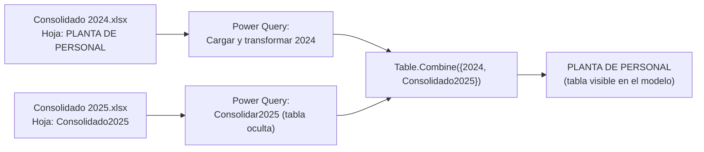
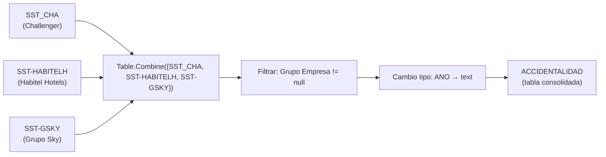

# Pipeline de Datos

> Fuente oficial de informacion sobre origenes de datos, transformaciones Power Query y proceso de actualizacion.
> Para las medidas ver [METRICS_CATALOG.md](METRICS_CATALOG.md).

---

## Estado actual de fuentes (2026-07-24)

La estrategia vigente es migrar las fuentes Excel desde rutas personales de SharePoint/OneDrive hacia el sitio corporativo:

```text
https://lemcosas.sharepoint.com/sites/TalentoHumanoGrupoLemco
```

El patrón técnico vigente para el bloque actual se mantiene como:

```powerquery
Excel.Workbook(Web.Contents("<url corporativa>"), null, true)
```

No se ha aprobado todavía una refactorización a `SharePoint.Contents`, `SharePoint.Files`, parámetros o funciones compartidas.

Estado documentado:

| Familia | Estado |
|---|---|
| `PptovsReal.xlsx` | Ruta corporativa aplicada, validada y publicada para `Planta Ppto`, `Ppto Retiros` y `Ppto Ingresos` mediante commit tecnico `e287657` |
| `Consolidado 2024.xlsx` / `Consolidado 2025.xlsx` | Rutas corporativas identificadas; `PLANTA DE PERSONAL` sigue pendiente de refresh exitoso |
| Selección / SENA | Rutas corporativas revisadas; `SENA UNIDADES` debe conservar `Item="SENA", Kind="Sheet"` |
| SST / Accidentalidad | Ruta corporativa documentada para `Accidentalidad_Consolidado.xlsx` |
| Incapacidades / CIE-10 | Ruta corporativa reportada para `Incapacidades_GL.xlsx`, pendiente de validación final |
| Días Laborales | Ruta corporativa reportada para `Feriados.xlsx`, pendiente de validación final |
| `AUSENTISMOS` y `Estructura` | Persisten como fuentes personales o pendientes de análisis |
| `AREAS` | Sigue ligada a `Consolidado 2024.xlsx`; requiere análisis posterior antes de cambiar origen |
| `REQUISICIONES HABITEL 2026.xlsx` | Fuente nueva fuera de alcance; requiere Spec propia |

Para `PptovsReal.xlsx`, el refresh y las paginas dependientes fueron validados funcionalmente por el usuario antes del commit tecnico `e287657`. Para las demas familias, el refresh local completo no debe declararse exitoso hasta validar `Aplicar cambios` y refresh sin errores en Power BI Desktop. Ver [TROUBLESHOOTING.md](TROUBLESHOOTING.md).

## Patron general

Todas las fuentes de datos son archivos **Microsoft Excel alojados en SharePoint/OneDrive**. El acceso se realiza mediante la funcion `Web.Contents` de Power Query apuntando a la URL de descarga del archivo en el tenant de Microsoft 365 de la organizacion.

No existen parametros de Power Query formales. Las rutas a los archivos estan **hardcodeadas** en el codigo M de cada tabla.

---

## Cuentas y sitios de SharePoint identificados

El modelo históricamente consumió datos desde cuentas personales y actualmente avanza hacia el sitio corporativo:

| Origen | Estado | Tablas o familias |
|---|---|---|
| `lemcosas.sharepoint.com/sites/TalentoHumanoGrupoLemco` | Objetivo corporativo | HeadCount, PptovsReal, Selección, SENA, SST, Incapacidades y fuentes futuras |
| `edwin_clavijo_challenger_co` | Origen personal histórico | Debe eliminarse gradualmente cuando exista ruta corporativa aprobada |
| `maria_bohorquez_challenger_co` | Origen personal histórico | Persisten referencias en fuentes pendientes como `AUSENTISMOS` y `Estructura` |

> Las credenciales y niveles de privacidad se gestionan en Power BI Desktop / Power BI Service. Las fuentes corporativas combinadas deben quedar como `Organizacional`. Ver [SECURITY_AND_PRIVACY.md](SECURITY_AND_PRIVACY.md) y [TROUBLESHOOTING.md](TROUBLESHOOTING.md).

---

## Inventario de fuentes de datos

### Fuentes HeadCount / Presupuesto / SST

| Archivo | Hoja(s) consumida(s) | Tabla(s) resultante(s) | Grupo |
|---|---|---|---|
| `Consolidado 2024.xlsx` | `PLANTA DE PERSONAL` | Parte de `PLANTA DE PERSONAL` (via `Table.Combine`) | HeadCount |
| `Consolidado 2025.xlsx` | `Consolidado2025` | `Consolidado2025` (staging oculta) | HeadCount |
| `PptovsReal.xlsx` | `Planta Personal` | `Planta Ppto` | PptovsReal |
| `PptovsReal.xlsx` | `RETIROS` | `Ppto Retiros` | PptovsReal |
| `PptovsReal.xlsx` | `INGRESOS` | `Ppto Ingresos` | PptovsReal |
| `Accidentalidad_Consolidado.xlsx` | `SST GENERAL` | `SST GENERAL` | SST |
| `Accidentalidad_Consolidado.xlsx` | `(hoja SST_CHA — Pendiente de confirmar nombre)` | `SST_CHA` | SST |
| `Accidentalidad_Consolidado.xlsx` | `(hoja SST-HABITELH — Pendiente de confirmar nombre)` | `SST-HABITELH` | SST |
| `Accidentalidad_Consolidado.xlsx` | `(hoja SST-GSKY — Pendiente de confirmar nombre)` | `SST-GSKY` | SST |

> Nota: `SST_CHA`, `SST-HABITELH` y `SST-GSKY` son tablas intermedias que se consolidan en `ACCIDENTALIDAD` mediante `Table.Combine`. No tienen relaciones propias en el modelo.

### Fuentes Selección / Ausentismo / Medicina

| Archivo | Hoja consumida | Tabla resultante | Grupo |
|---|---|---|---|
| `Ausentismos Power BI.xlsx` | `AUSENTISMOS` | `AUSENTISMOS` | *(sin grupo)* |
| `Maestro.xlsx` | `Maestro` | `Maestro` | *(sin grupo)* |
| `Incapacidades_GL.xlsx` | `Incapacidades` | `Incapacidades` | Incapacidades |
| `REQUISICIONES_CYL.xlsx` | `Matriz 2025` (con 4 filas de encabezado a saltar) | `Seleccion Challenger` | Seleccion |
| `REQUISICIONES HABITEL.xlsx` | `(hoja — Pendiente de confirmar)` | `Seleccion Habitel Hotels` | Seleccion |
| `REQUISICIONES SKY.xlsx` | `(hoja — Pendiente de confirmar)` | `Seleccion Grupo Sky` | Seleccion |
| consultas base de selección | append / transformaciones | `Seleccion Grupo Lemco` | Seleccion |
| `SENA.xlsx` | `SENA` | `SENA UNIDADES` | SENA |
| `Estructura.xlsx` | `Estructura` | `Estructura` | *(sin grupo)* |

### Fuentes embebidas (sin SharePoint)

| Tabla | Tipo | Descripcion |
|---|---|---|
| `Empresas` | Binario comprimido inline en M | Catalogo de empresas hardcodeado en la consulta Power Query como datos binarios comprimidos (Base64 + Deflate) |
| `Mes` | Binario comprimido inline en M | Dimension de meses con nombres en espanol y numeros ordinales |
| `DimPeriodoYM` | Tabla calculada DAX | `CROSSJOIN('Anos', 'Mes')` — generada en el motor de Analysis Services |
| `tbl_Refresh` | Calculada en M | `DateTimeZone.UtcNow()` convertida a UTC-5 (Bogota) |

---

## Flujo de carga: PLANTA DE PERSONAL (patron especial)

La tabla `PLANTA DE PERSONAL` consolida dos anos de datos mediante un patron de staging:



**Transformaciones aplicadas en `PLANTA DE PERSONAL`:**
1. Carga desde Excel (hoja `PLANTA DE PERSONAL`)
2. Promocion de encabezados
3. Cambio de tipos de columna (MES, ANO, SUELDO_B, F_INICIO, F_CENCIM, etc.)
4. Renombrar `RANGO DE EDAD` → `GENERACION`
5. `Table.Combine` con la tabla `Consolidado2025`
6. Renombrar `GENERACION` → `GENERACI&#211;N` (encoding HTML — ver [DATA_MODEL.md](DATA_MODEL.md#riesgos-del-modelo))
7. Normalizar a `Text.Proper`: OBSERVACION, EST_CIVIL, TIPO_CONTR

**Transformaciones aplicadas en `Consolidado2025`:**
1. Carga desde Excel (hoja `Consolidado2025`)
2. Renombrar `RANGO DE EDAD` → `GENERACION`
3. Cambio de tipo MES a texto
4. Todos los campos marcados como ocultos (`isHidden = true`) excepto AGRUPADOR, SEGMENTO, COD, DEPARTAMENTO y otros de identificacion

---

## Flujo de carga: ACCIDENTALIDAD (patron de consolidacion SST)



> `SST_CHA`, `SST-HABITELH` y `SST-GSKY` son tablas con datos de accidentalidad por empresa. Se mantienen independientes para permitir analisis por empresa y se consolidan en `ACCIDENTALIDAD` para analisis multi-empresa.

---

## Transformaciones relevantes en tablas de Seleccion

La tabla `Seleccion Challenger` tiene el proceso de transformacion mas extenso del modelo (~25 pasos):

1. Saltar 4 filas de encabezado en el Excel
2. Cambio de tipos de columna
3. Normalizacion de nombre de empresa (`"CHALLENGER"` → `"Challenger"`, `"LEMCO "` → `""`)
4. Estandarizacion de nombres de ciudad (20 operaciones `Table.ReplaceValue` para limpiar espacios, tildes y abreviaciones)
5. Estandarizacion de nombres de dependencia (capitalizacion correcta)
6. Eliminacion de columnas sensibles (persona reemplazada, encargado, nombre del seleccionado, identificacion, fecha contratacion)
7. Adicion de columnas derivadas: `Mes_Req`, `Mes_Meta`, `Ano_Met`, `Grupo Empresa`
8. Filtrado de registros con `Grupo Empresa = "Validar"` (descarta datos sin empresa reconocida)

---

## Mecanismo de actualizacion del timestamp

La tabla `tbl_Refresh` captura el momento exacto de la actualizacion del modelo:

```
DateTimeZone.UtcNow()                    -- hora UTC del servidor
→ DateTimeZone.SwitchZone(UtcNow, -5)   -- convierte a UTC-5 (Bogota / Lima)
→ DateTimeZone.RemoveZone(BogotaNow)    -- elimina la zona horaria, deja solo datetime
→ Tabla de una fila con columna FechaActualizacion
```

Esta tabla alimenta la pagina **Fecha de Actualizacion** del reporte.

---

## Flujo de carga: PptovsReal

`PptovsReal.xlsx` se consume desde el sitio corporativo de SharePoint del Grupo Lemco mediante el patron vigente:

```powerquery
Excel.Workbook(Web.Contents("<url corporativa>"), null, true)
```

Consultas asociadas:

| Hoja | Tabla semantica | Estado |
|---|---|---|
| `Planta Personal` | `Planta Ppto` | Migrada a SharePoint corporativo |
| `INGRESOS` | `Ppto Ingresos` | Migrada a SharePoint corporativo |
| `RETIROS` | `Ppto Retiros` | Migrada a SharePoint corporativo |

La ruta personal anterior dejo de ser el origen activo de estas tres consultas. La migracion fue validada mediante refresh y revision funcional del usuario, y quedo publicada en el commit tecnico `e287657acc948672b274d7907b736a455428a258`.

### Insumo manual de gasto laboral 2026

El archivo local `Data/HeadCount/2026/06_Junio/Gasto Laboral 2026.xlsx` contiene informacion actualizada a junio de 2026 y se conserva como insumo operativo para actualizar manualmente la hoja `Planta Personal` de `PptovsReal.xlsx`.

El flujo asociado es:

1. Revisar y validar el corte de `Gasto Laboral 2026.xlsx`.
2. Trasladar manualmente la informacion aprobada a la hoja `Planta Personal` de `PptovsReal.xlsx`.
3. Publicar o reemplazar `PptovsReal.xlsx` en su ubicacion corporativa gobernada.
4. Actualizar y validar en Power BI la consulta `Planta Ppto`, que consume esa hoja.

`Gasto Laboral 2026.xlsx` no es una fuente consumida directamente por Power Query. Se almacena bajo `Data/` por contener informacion operativa de personal y potencialmente salarial; queda excluido de Git mediante `.gitignore` y no debe forzarse su versionamiento.

---

## Limitaciones y riesgos del pipeline

| # | Riesgo | Impacto |
|---|---|---|
| 1 | Rutas hardcodeadas | Cualquier renombramiento o movimiento de archivo rompe la carga sin aviso |
| 2 | Dos cuentas propietarias de archivos | Dependencia en personas especificas; riesgo de indisponibilidad |
| 3 | Archivo `PptovsReal.xlsx` compartido | Tres tablas (`Planta Ppto`, `Ppto Retiros`, `Ppto Ingresos`) dependen del mismo Excel corporativo; cambios en el archivo afectan multiples tablas simultaneamente |
| 4 | Datos embebidos en binario (`Empresas`, `Mes`) | Para actualizar el catalogo de empresas hay que regenerar el binario comprimido en Power Query o cambiar el patron de carga |
| 5 | `REQUISICIONES_CYL.xlsx` usa `Matriz 2025` como nombre de hoja | Cada ano probablemente requiere actualizar el nombre de la hoja en el codigo M de `Seleccion Challenger` |
| 6 | Sin actualizacion programada documentada | No se conoce la frecuencia oficial de actualizacion (`Pendiente de confirmar`) |
